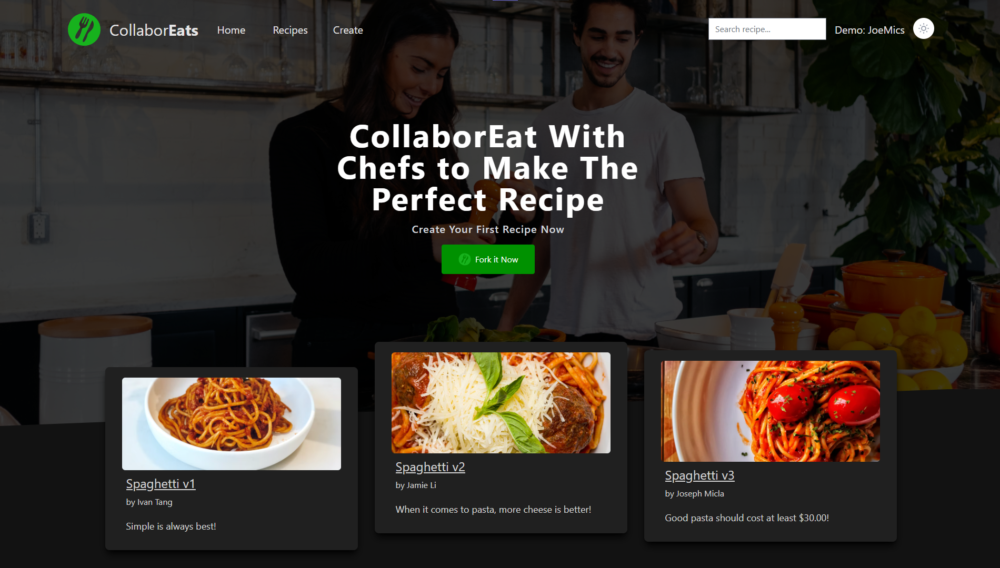
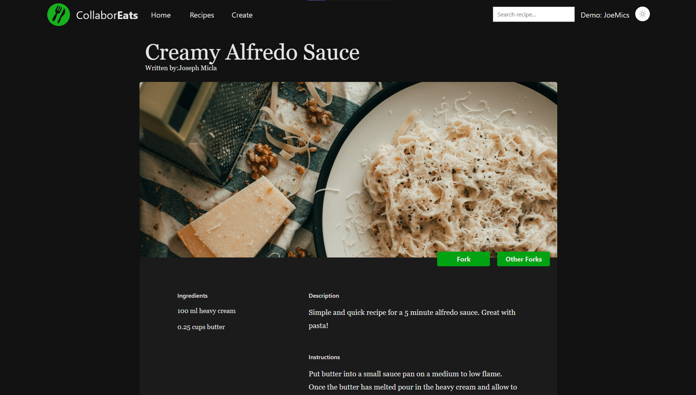
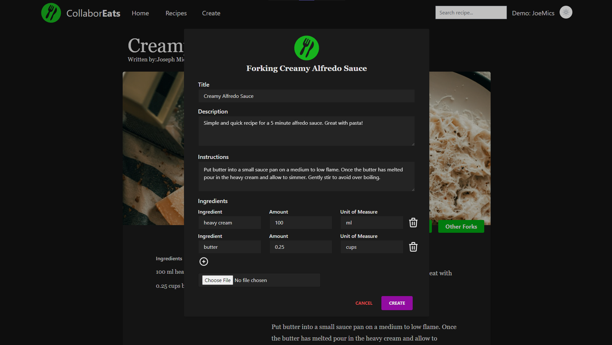
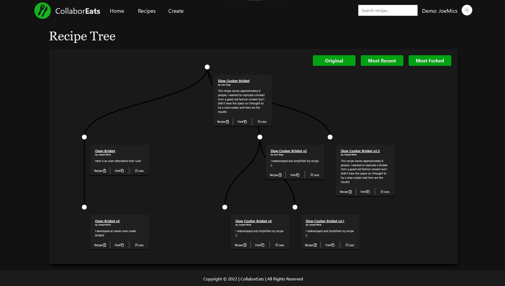
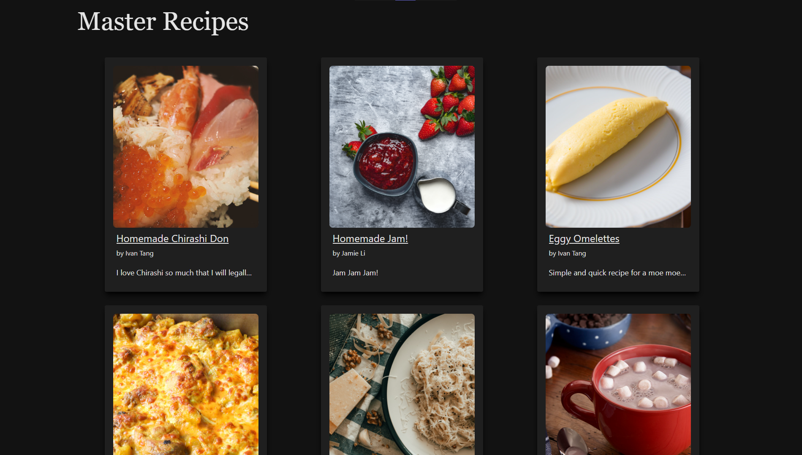

<h1 align="center">CollaborEats</h1>

## Table Of Contents

- [Summary](#summary)
  - [Web App Link](#web-app-link)
  - [Features](#features)
  - [Screenshots](#screenshots)
- [Getting Started](#getting-started)
  - [Client](#client)
    - [Setup](#setup)
    - [Running Dev Server](#running-webpack-development-server)
    - [Running Jest](#running-jest-test-framework)
    - [Dependencies](#client-dependencies)
  - [Server](#server)
    - [Setup](#api-setup)
    - [Resetting the Database](#database-reset)
    - [Dependencies](#server-dependencies)
- [About](#about)
  - [Frameworks and Libraries](#frameworks-and-libraries)
  - [Purpose](#purpose)

# Summary

CollaborEats is a **Single-Page Web Application (SPA)** built using the **MERN** stack.

CollaborEats allows you to create new versions of yours, or other people's recipes by "Forking" them. Every recipe is stored in a tree structure with the original recipe as the root, allowing you to make mistakes, and experiment without losing track of what you have done in the past.

## Web App Link

**Site status**

[](https://app.netlify.com/sites/vibrant-cray-95d891/deploys)

**The website can be found here:**
https://collaboreats.ca/

## Features

Users can:

- Create a new master recipe
- Create new versions of another recipe
- View all the versions of a recipe represented in a tree structure
- Comment on recipes
- See a list of their own recipes
- Toggle the UI from light mode to dark mode

## Screenshots







# Getting Started

## **Client**

```sh
cd client
```

### Setup

Install dependencies with

```sh
npm install
```

### Running Webpack Development Server

```sh
npm start
```

Server should be hosted on `http://localhost:3000/`

### Running Jest Test Framework

```sh
npm test
```

## Client Dependencies

- axios: ^0.25.0
- react: ^17.0.2
- react-d3-tree: ^3.2.0
- react-loading-skeleteon: ^3.0.2
- react-router-dom: ^5.2.0
- react-time-ago: ^6.2.1
- tailwindcss: ^3.0.15
- postcss: ^8.4.5
- autoprefixed: ^10.4.2

---

## **Server**

```sh
cd server
```

### Api Setup

Install dependencies with

```sh
npm install
```

copy the .env.example into a .env file

```env
PORT=8080
  -->This is where the API server runs

DB_URI=mongodb://localhost:27017/collaboreatsDevDB
  --> This can be the connection string to MongoDB Atlas, or an instance of MongoDB running in the local machine
```

### Database Reset

Resets, and seeds the database for development/testing.

```sh
npm run db:reset
```

## Server Dependencies

- express: ^0.25.0
- cors: ^2.8.5
- dotenv: ^12.0.3
- mongoose: ^6.1.6
- typescript: ^4.5.4
- ts-node: ^10.4.0
- aws-sdk: ^2.1071.0

# About

## Frameworks and Libraries

- MongoDB (Mongoose)
- Express
- React
- Ts-node
- React-d3-tree
- Tailwind CSS

## Purpose

This application was created as a final project for **Lighthouse Labs' Web Development Bootcamp**, by [Joseph Micla](https://github.com/JoeMics), [Jamie Li](https://github.com/LiJamie1), and [Ivan Tang](https://github.com/tangivan)
